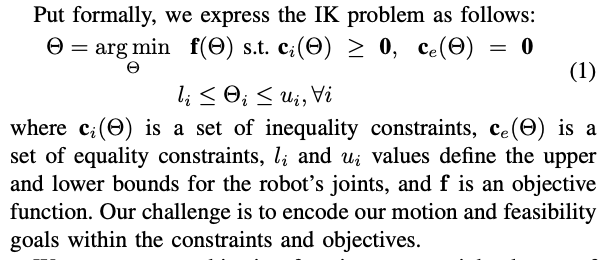
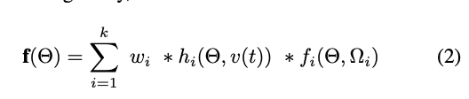
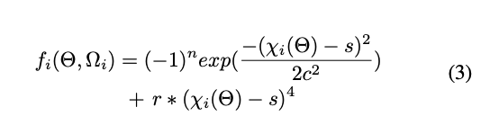

Paper from the <a href="https://graphics.cs.wisc.edu/Papers/2018/RMG18a/p43.pdf" target="_blank"  class="link_grey">UW Graphics Group</a>. 

APA citation: Rakita, D., Mutlu, B., & Gleicher, M. (2018, June). RelaxedIK: Real-time Synthesis of Accurate and Feasible Robot Arm Motion. In *Robotics: Science and Systems (pp. 26-30)*.

This paper highlights the following:
<ul>
  <li>Technique that is used to create smooth feasible motions that avoid joint-space discontinuities, self-collisions, and kinematic singularities</li>
  <li>Normalization procedure to satisfy multi-objective optimization constraints</li>
  <li>Using a neural network to approximate distance from collision states, and also using SVD to approximate distance to singular configurations</li>
</ul>

